# [Bigger Fish](https://bono-94.github.io/Javascript-Project-2/) 

Bigger Fish is an online game with various financial and entertainment elements. Randomly generated balance for user and robot allows everyone to experience the resources battle, both from a domination and strategical point of view. The game has been created for the possible participation of users from any target group. Besides the upcoming play-to-earn model with real currencies, this concept has been designed to complement the new global economic system as one of the main utilities and revenue streams. The project hopes to achieve a reduction of global poverty levels, bridge the gap between crypto investors and gamers and educate on relevant topics and technologies while providing a fun, relaxing, and colorful game that is directly linked to the real-life financials of users. Overall site Bigger Fish aims to demonstrate the developer's proficiency in coding languages HTML, CSS, and JAVASCRIPT while simultaneously disclosing one of the main products / services from the parent brand.

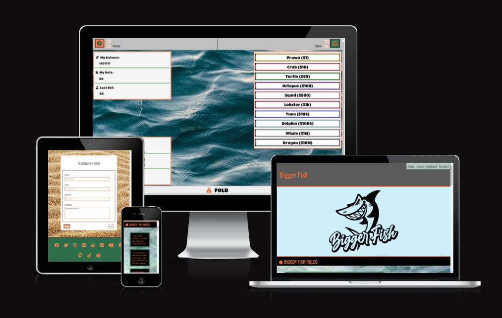
------

## Features 

In the first demonstrative version, minimum features and their elements have been disclosed in order to create a rich experience for users over longer periods of time. Also, for legal protection and initial attention from investors, a large amount of information has been summarized to cover main topics and categories before planned full disclosure. Meaning all of our aspects will be expanded shortly, professional media uploaded and final legally protected branding released. We will continue to improve consistently while strategically releasing new content and features according to our planned agenda and the current state of users. This site is made fully responsive across a variety of devices with the lowest guaranteed working width of 360px and height of 640px taking older cellular models into consideration in order to establish a global presence.

### Existing Features

__Navigation Bar__

  - The navigation bar is set at the top of the page. However, when the game mode starts, it gets removed until the user decides to start again and land back here from any of the results screens: winning, losing, and folded
  - Navigation bar provides the user with identification that it is the correct game next to shortcuts for accessing desired sections of the page
  - The navigation bar is intuitive and all types of users can navigate to the desired section without needing any further explanation
  - The main title is written in coral color standing out with the largest font size. It takes the user back to the same page but refreshed
  - The menu bar to the right of the game title is directing users to the main four categories of the page: Rules, Game, Feedback, and Contact. On the larger screens, the menu is shown next to the main title, while for tablet and phone sizes of screen, it is located under the title stretching across the screen  
  
    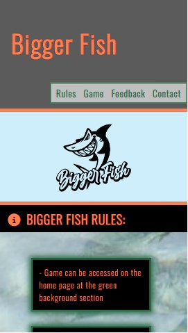

__Cover Media__

  - The landing cover media includes a professional custom-made logo that is also used as a current tab icon. There is the main mascot of the brand, Sharky above the title of the game. The logo has been made considering all ages
  - This section introduces the user to the Bigger Fish page with an eye-catching sharp and creative animation of the logo increasing size from the dot to full size. This will grab users' attention and increase the chances of a great first impression
  - Without an extensive text introduction requiring serious participation, the image relaxes the user with smooth light-sky-blue colors smoothly bringing users over to the next section that discloses the rules. Instead of first reading, then relaxing, we wanted the user to build up the energy instead of dropping it before the game due to too many textual distractions

    

__Rules__

  - Once users' attention is captured from landing elements, highly important and summarized information on how to play the game is given to process
  - Full game rules have been disclosed in this section assuring smooth gameplay for a user and answering any potential general questions proactively
  - Following the bright coral-style and reef-style visuals and captivating background of shallow water, a user is provided with text blocks that have the effect of being overtaken by algae after spending a long time sitting in the water. This tells the user that rules are always consistent and remained this way for a long time already. Again, the main colors of green, coral, and gray are utilized to achieve a good contrast and visual categorization. Overall design is made for all ages implementing playful yet informative rules section

    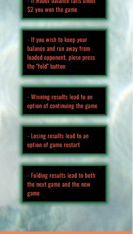

__Insert Coin__

  - This section serves the purpose of being the bridge that leads the user to the actual game screen from the home page.
  - There is an animation where after a user presses the insert lifecoin button, a 3D logo of a coin appears and animates being placed inside a window on a megalithic temple. Shortly after the animation start, a small earthquake trembling sound effect starts
  - Once trembling is done, the entire screen is wiped clean and transferred to the Video Intro section
  - Having elements of image animation and button click arcade sound effects for youth, cryptocurrency coin for adults and megalithic segment for an older generation and history lovers, this section is also made to satisfy criteria of possible usage for any type of user no matter their age or favorite knowledge topics

    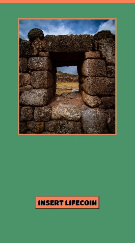

    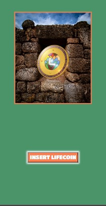

__Feedback Form__

  - The feedback form will allow the users to enter the second level of participation. The first one is obviously to play the game and communication with social media. With this form, a player is engaged to share his opinions and criticism, next to even more important ideas generation. This way user is provided with an option to construct on top of the original game without limitation and this way to become the game. As well, there are benefits to customizing the game from life experiences based on personal preferences or past without or with other player's participation
  - By completing this short online form, users' personal information of name, and email are presented in order to be able to contact them back with a response and address them properly. Location is required in order to know to which regional server of the game user belongs so their request can be forwarded to the correct regional office and team. Also allows multi-lingual support
  - Feedback form has been designed to fit every user with a white sheet representing a piece of paper which is a general global way of reading. All segments have been separated and categorized with the subtle coloring of the main website colors: coral, gray, and green
  There is sand in the background representing the point of view that the user is standing on the beach reading or writing feedback form. This is very important and creates a subliminal experience and deeper connection between all home page and gaming sections. The reason is that looking from the bottom towards up, the footer with gray color represents a road and the coral-colored line on the copyright envisions a fence or separation between road and grass. The grass is represented with green social media icons which are usually the small green patches of grass on a majority of beaches at the entrance. The next layer or level in constructing this site was our beach sand and feedback form that guides the user to another green part which can be a beach park or beach towel with megalithic ruins that launch the game. If users wish to know if "there are fishes in the waters", they need to go to the shallows and read the rules box. Above the rules box and shallow water, there are cover media with a light-sky-blue background representing the sky and the navigation bar in the user's imagination would be a big fixed box in the sky. Once users explore the "beach area" they can interact by inserting a lifecoin that takes them to all gaming segments with hints on deep waters. Therefore, a feedback form is the key to separating game mode from home screen mode and creating a specific atmosphere based on the current status
  
    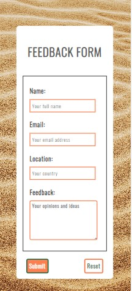

__Footer__

  - The footer section includes links to the selected few social media sites for Bigger Fish. There is also a copyright section and version control. Footer is broken down visually into those three parts, all made up of the main site's colors green, coral, and dark gray
  - The social media links from icons will open into a new tab to allow easy navigation for the user and to keep our site always open. This project's first version is for demonstrative purposes and links for now guide to the general sites, not our main social media accounts since they are being built under the actual name that will be copyrighted and branded. Footer is very important to the users because it also gives further options to visit that expand to other widely used sites, connect with the Team with any requests or problems 
  - Copyright segment offers direct information on the copyrighted status of the game and the year
  - Third and final part is the version control for users familiar with the development's team products and services. Here is where users can find out instantly which version they are using with the accompanying release date. The next row discloses to users who is the parent brand or sponsor that is powering the Bigger Fish website and team. And finally, at the bottom, there is a README link to the Bigger Fish README for all users unfamiliar with GitHub. This is extremely useful because users can see what is the full concept and partial development behind their favourite game. Eventually, this will lead us to offer packages to users with percentages of full code and/or knowledge sharing and disclosure of our products and services
  
    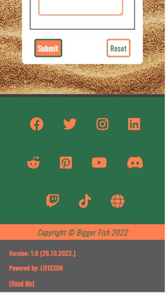

__Intro Logo Video__

  - This section is the first thing that users can see upon entering the "game mode" coming from "home screen mode"
  - Professional short video is being used to replicate the common approach in starting the game with brand logo animation
  - Gaming transforming sound is also included in the video that adds quality levels to the user experience and serious branding
  - There is a black background behind the black video allowing it to stretch to any screen size
  - Upon ending of the video, users are automatically transferred to the Welcome Screen while removing the intro video from the screen

  
    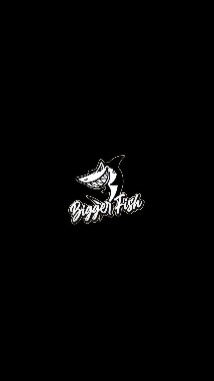

__Welcome Screen__

  - Welcome Screen or better known as the Game Landing screen is the first interactive segment of the whole Game Screen
  - First, it welcomes the user to the game with a title, and then it informs the user who are the characters playing against each other. Following from top to bottom next is the wisdom quotation that allows the user's brain of thought to flow and predicts the main concept that needs to grasp in order to dominate the game. This quote will constantly keep opening thought processes in the users' brains. Following the quotation, the user can choose either to start a game by pressing the interactive button with sound or following the development team-connected website where it says: "Game by:". Developers have made the logo an active anchor that takes a user to the parent brand website that this game is essentially part of. There is no indication that the logo is a link besides hovering. This is done in order to prevent a user from being distracted from starting the game and browsing around the parent brand. Therefore this optional branch has been placed for curious users only that want to know more about who made the game.
  - Upon clicking on the start button, users are automatically transferred to the Loading Logo Screen while removing the welcome page from the screen

    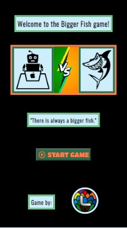

__Loading Logo Video__

  - This section contains a loading video that users can see after starting the game
  - Professional short video is being used to replicate the common approach in game loading screens to prevent too rapid switching between game screens under the price of user experience
  - Dramatic music and ocean storm are included in the video that adds quality levels to the user experience 
  - There is a black background behind the black video allowing it to stretch to any screen size
  - Upon ending the video, users are automatically transferred to the Game Board Screen while removing the loading video
  
    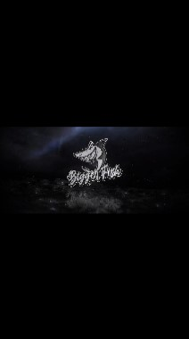

__Game Board__

  - Game Board section is the most important section of the entire website. Here is where users can track scores and balances while placing bets against their opponent. This is where users play the game which has been designed to fit as many different types of users while keeping all their demands and expectations by introducing something for everybody
  - First thing that happens when a user lands on the screen is a system alert informing the user that a new balance was generated
  - Following the alert, the user's and robot's win-loss score is automatically set to 0 since the user is initiating a new game
  - In case that user initiates the next game, records get automatically transferred from previous Results Screens (win / loss / fold)
  - After receiving their previous or new scores, both players will receive a randomly generated balance from 1$ to 21,042,004 which is the birthdate of our inspiration source under the name Maximus The Second. In the second version, the user will be able to place(sacrifice) their real-life coins (real cryptocurrency) in order to receive a random amount of Bigger Fish crypto tokens that will also be real
  - Game Board consists of 2 parts: Tracker and Battlefield
  - Tracker is at the top of the screen separated clearly with gray color from the rest of the board as it is representing technicalities
  - Tracker displays player's categorization clearly separating the user from their opponents with different color icons and players' names
  - Next to names, there is a live tracking scoreboard which always clearly informs the user of their record
  - Once the balances and scores are uploaded, a battle between players starts on the Battlefield
  - The background of the game board where all action happens is a picture of waves on the deep seas, following the design structure principles from the index page
  - On the game board and on the left side of it, the screen user can find live results showing user balance, last bet, and total bets. There is also a full reward score named Treasure Vault that adds up both players' bets. From the opponent side, the user can only see their last bet to prevent a boring game when a user would know how big the other fish is and line up decisions based on both balances. The robot's score and balance are real, tracked, and random. Only strategically undisclosed to the user
  - On the right side of the board, there is a long-lengthed selection of 10 buttons that are each associated with different ocean animals. Each animal represents one amount of up to 10 million that users can pick from when placing bets. There is also a fold button located at the bottom that allows users to leave the match while keeping their balance if they suspect they aren't big enough fish
  - Users always start first and before Robot. When the user clicks on the bet in any amount, the user balance is immediately subtracted by the selected betting value. Total Bets and Treasure Vault are increased by a betting value
  - Every user's action with complimenting splash sound effect initiates one Robot's bet(response) 
  - The computer chooses a random option for the Robot's bet through JavaScript which equals to one of the betting buttons that the user can see on their screen
  - Robot's balance gets subtracted by the selected betting value
  - Robot's last bet changes the value to be equal to the last selected betting value
  - Treasure vault gets increased by Robot's selection
  - Turn-by-turn loop continues until the user receives an alert that one of the player's balance drops below $2, or one of them folds while retaining their balance
  - If users win, they are sent to the "Winning Screen"
  - If users lose, they are sent to the "Losing Screen"
  - If user folds, they are sent to the "Folded Screen"
  
    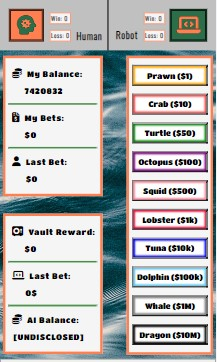

__Winning Screen__

  - Winning Screen is one of the 3 Results Screens
  - Title informs the user on the previous winning game outcome with a relevant icon to separate all 3 result screens with the same design layout
  - Image of an opened treasure chest with coins represents the Treasure Vault from the Game Board
  - Subtitle informs the user if they were bigger or smaller fish to support results in a title for users that automatically look at the middle instead the top of pages when they load
  - There is a result block that shows the user what was the value of the won Treasure Vault, the user's updated live balance after adding the earned treasure. The winning record gets updated as well adding +1
  - Styling has been done again emphasizing the main page's colors coral and green. The background of the screen is black as it is set for all game running features that are not on the index page in order to achieve a game console mode feeling for users. Results and subtitles are again colored in light-sky-blue shade matching the main cover media with the Bigger Shark logo to make it seem as the hole in the game screen, but since it is not white it is not so distracting and obvious while still following the secondary coloring scheme of the index page
  - Upon clicking on the next game button, users are automatically transferred to the next Loading Logo Screen before continuing on to the next game while removing the Winning Screen
  - This provides a fully closed and infinite loop of gaming for users by providing an experience without interruptions

    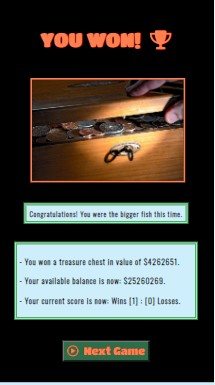

__Losing Screen__

  - Losing Screen is one of the 3 Results Screens
  - Title informs the user on the previous losing game outcome with a relevant icon to separate all 3 result screens with same design layout
  - The image of person emptying out a small change represents the user running out of game balance
  - Subtitle informs the user if they were bigger or smaller fish to support results in a title for users that automatically look at the middle instead the top of pages when they load
  - There is a result block that shows the user what was the value of the lost Treasure Vault, and the user's updated live balance. The losing record gets updated as well adding +1
  - Styling has been done again emphasizing the main page's colors coral and green. The background of the screen is black as it is set for all game running features that are not on the index page in order to achieve a game console mode feeling for users. Results and subtitles are again colored light-sky-blue shade matching the main cover media with the Bigger Shark logo to make it seem as the hole in the game screen, but since it is not white it is not so distracting and obvious while still following the secondary coloring scheme of the index page
  - Upon clicking on the new game button, users are automatically transferred to the new Loading Logo Screen before being automatically taken back to the index page where they can insert lifecoin again to generate a new balance and score
  - This provides a fully closed and infinite loop of gaming for users by providing an experience without interruptions

    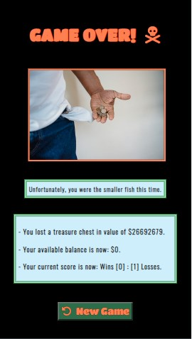

__Folded Screen__

  - Folded Screen is one of the 3 Results Screens
  - Title informs the user on the previous losing and game quitting outcome with a relevant icon to separate all 3 result screens with same design layout
  - The image of an orca surfacing up for air represents the user's size of a fish that is not too small like a dolphin or too large like a whale. Medium-size fish that managed to escape the bigger whale and rushes to the surface for air, creating a metaphor to support the middle-size fish escaping larger enemy
  - Subtitle informs the user if they were bigger or smaller fish to support results in a title for users that automatically look at the middle instead the top of pages when they load
  - There is a result block that shows the user what was the value of the lost Treasure Vault, and the user's updated live balance. The losing record gets updated as well adding +1
  - Styling has been done again emphasizing the main page's colors coral and green. The background of the screen is black as it is set for all game running features that are not on the index page in order to achieve a game console mode feeling for users. Results and subtitles are again colored light-sky-blue shade matching the main cover media with the Bigger Shark logo to make it seem as the hole in the game screen, but since it is not white it is not so distracting and obvious while still following the secondary coloring scheme of the index page
  - User is here presented with 2 choices of playing again: New and Next Game, unlike the winning and losing screen only featured one each
  - Upon clicking on the next game button, users are automatically transferred to the next Loading Logo Screen before continuing on to the next game while removing the Winning Screen
  - Upon clicking on the new game button, users are automatically transferred to the new Loading Logo Screen before being automatically taken back to the index page where they can insert lifecoin again to generate a new balance and score
  - This provides a fully closed and infinite loop of gaming for users by providing an experience without interruptions
  
    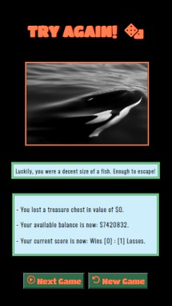

---
### Upcoming Features

__Next Version__

- Multiplayer Mode 
- Teams and Groups Creation
- Game mode vs. Friends (custom link join)
- Game mode vs. Public (random link join)
- Usage of real digital and cryptocurrencies
- Digital and cryptocurrencies conversion
- P2P Transactions
- Multiple Accounts with Free Transfers
- User Profiles & Password Protection
- Deposit Currencies & Tokens
- Withdraw Currencies & Tokens
- Virtual Bank & Balance
- Transactions List
- Balance History
- Game Breakdown Payments
- NFT Rewards
- Multiverse
- Open World Game Development
- Variety of Game Maps
- Integration with Revolut, Paypal, etc…
- Live Chat
- Rating the Opponent
- Live Leaderboard List
- Rankings, Levels & Memberships
- Opponent's Last Scores
- Custom Avatars
- Multipliers and Combos
- Alternative Staking Options 
- Periodical Visit and Play Time Reward System
- Tournaments and Challenges
- Professional Designs and Animations
- Inclusion of secondary layer games such as card games or sport event
- Investing Custom Amount
- Amounts Mathematical Calculations
  
---

## Testing 

I have conducted enough hours of testing across all screen sizes and different browsers to conclude that now the site works well and all discussed features are included as intended. Internet Explorer, Google Chrome, Safari, and Firefox on large PC monitors, average laptops, tablets, and various mobile devices all in different screen sizes. The website was given to friends and family to test out the game representing different types of users and their playing styles next to personal backgrounds. All content is readable and understandable styled with good contrasting colors that also visually create a good combination. Game-tracking works every time and the robot produces random responses every time as designed.

### Validator Testing 

- HTML
  - No errors when passing through the official [W3C validator](https://validator.w3.org)

- CSS
  - No errors when passing through the official [Jigsaw validator](https://jigsaw.w3.org/css-validator)

- Jshint
  -  No errors when passing through the official [Jshint validator](https://jshint.com)
  - Metrics returned:
    - There are 67 functions in this file
    - Function with the largest signature take 0 arguments, while the median is 0
    - Largest function has 16 statements in it, while the median is 4
    - The most complex function has a cyclomatic complexity value of 13 while the median is 1

- Accessibility
  - This test confirms that the colors and fonts chosen are easy to read and accessible to users. All scores are satisfactory besides performance since the site uses complex visuals and animation and large media which will be solved with the next update. The only issue found by the Lighthouse is referring to picture sizes, which are not impacting any animation or positioning of additional elements. It causes more taxation on the computing system and increases loading time, but the final results are as coded across all screens. All common practices and SEO levels have passed with a full percentage

    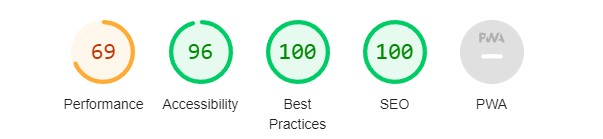
---
### Bugs

  - #### Solved Bug - Icons Not Displaying
    - Problem statement:
      - During the creation of the main Game Screen, an issue of not displaying icons from [Font Awesome](https://fontawesome.com/) was observed on all screens that were created in JavaScript after deleting content from the index page that ultimately bring a user to the Game Console experience
    - Problem troubleshooting:
      - During the troubleshooting with Code Institute Tutors, we noticed that the script from Font Awesome was not running on the newly created screens since the script anchor element for their website was removed to create the Game Console experience

    

    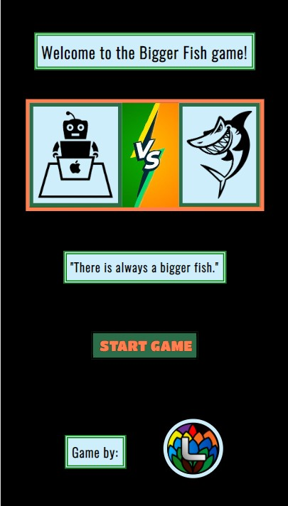

    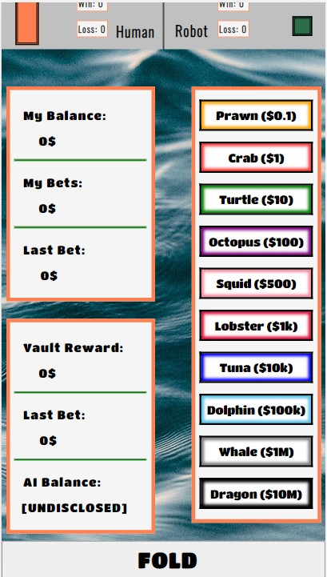

  - Problem solved with media:
    - Bug was solved by experimenting with a few ideas which one for adding the script for Font Awesome inside of the head element of the index page worked ever since

    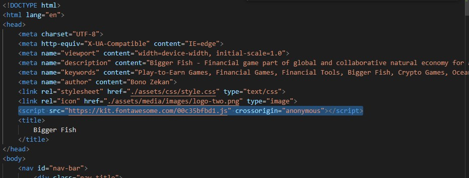

    

    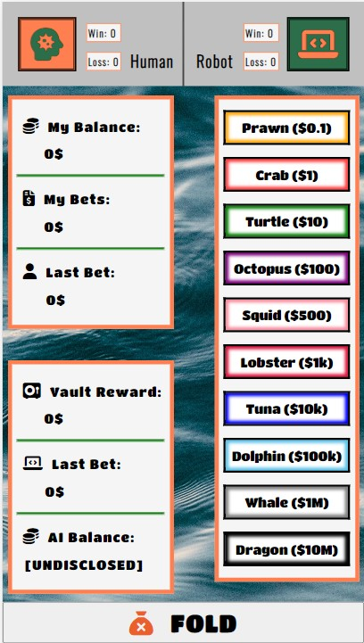

#### Unsolved Bug - Next Game

- Problem:
  - When a user leaves the winning screen or folding screen and tries to start the next game, Robot's new balance is not randomly generated as each new game start. Code is taking the old losing balance of under $2 to the next game
- Position:
  - Since this is a demonstrative demo version for our users and for potential investors, we decided not to solve this bug until Version 2
- Reasoning:
  - We wanted to create a trailer for the next version for a user without a direct marketing trailer and bring them back for more subliminally. Our intentions are to create an effect of anticipation while disclosing a small percentage of our full concept for everyone's benefit. This bug has been solved but left without a solution in this version's code on purpose to give the player only one turn in the next game. We found this to be a good way to show the whole game without showing the whole game too. The journey is as important as the final product that it will keep users interested instead of giving away everything at once. Strategic long-term release of this game is part of our core business strategy

    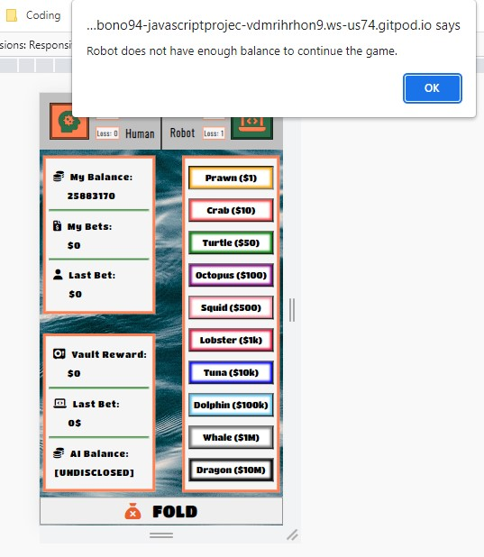

---

## Deployment

- The site was deployed to GitHub pages. The steps to deploy are as follows: 
  - In the GitHub repository, navigate to the Settings tab 
  - From the source section drop-down menu, select the Master Branch
  - Once the master branch has been selected, the page will be automatically refreshed with a detailed ribbon display to indicate the successful deployment. 

The live link can be found below:

  - [GitHub Public Site](https://bono-94.github.io/Javascript-Project-2/)

---

## Credits 

### Content, Knowledge and Code
  
  - All content and code are 100% unique and custom-made per request for a client in order to prevent any legal issues in the future and to provide full control over an optimized experience

  - All content, concepts, and visuals have been exclusively written for this site without any external inspiration

  - Code structure is also 100% original and completely created by a developer. A developer has followed HTML, CSS, and JavaScript courses at [Code Institute](https://codeinstitute.net/global/) where theory on building blocks has been taught. After reading through knowledge materials to see what are possibilities of creating this site are, general blocks have been put together separately to create original work. Given completed examples have not been plagiarized but served as a general guide from a client for a developer. Finally, the README structure has been used by Code Institute in this project in order to be created under industry standards and expectations. Their examples of projects such as Love Maths and Rock-Paper-Scissor game have been used as a guide to proper usage of newly introduced Java functions. A general template repository created for students before commencing their project for convenience has been imported before the first coding lines. Project requirements have been used as secondary rough guidelines for the content structure. Consultations with Student Care, Tutors, and Personal Mentor Rowan were provided by them as well which was crucial in this project creation by providing support, motivation, and mistakes indications

  - All debugging and problem-solving has been done strictly by the developer trying different combinations with known and unknown elements and attributes. No external sources and no professional help just imagination and creativity
 
  - [W3schools](https://www.w3schools.com/) has been used as an additional knowledge course. Reading over the second set and point of view on theory and understanding of elements to seal the Code Institue knowledge and review before writing the project for a full rough draft of the idea

  - [Codepad](https://codepad.co/snippet/button-with-sound-effect) has been used to give Java instructions on how to play sound at a specific place in functions and how to do it. Code was not used directly but as a learning method to understand new concepts. 

        $(document).ready(function() {
    
          var audio  = new Audio('https://s3-us-west-2.amazonaws.com/s.cdpn.io/242518/click.mp3');
          var audio2 = new Audio('https://s3-us-west-2.amazonaws.com/s.cdpn.io/242518/clickUp.mp3')

          $(".button").mousedown(function() {
            audio2.load();
            audio2.play();
          });
          
          $(".button").mouseup(function() {
            audio.load();
            audio.play();
          });
        });

- [FreeCodeCamp](https://www.freecodecamp.org/news/refresh-the-page-in-javascript-js-reload-window-tutorial/) has been used to learn more about another unknown concept in JavaScript which helped the project to switch from Gaming Mode back to the index Website Mode

      window.location.reload();

- [W3Schools](https://www.w3schools.com/js/js_random.asp) has been used to build on the Math.random knowledge from Code Institute by adding minimum and maximum values to each randomly generated numbers

      Math.floor(Math.random() * 100) + 1;

### Media

  - Every photo and both videos featuring coins or logos are all original works created especially for this site

  - The background photos on all pages that represent nature have been all downloaded from only 2 external sources:
  
    - [Pexels](https://www.pexels.com/)

    - [Unsplash](https://unsplash.com/)

 - The photos used in this README file to demonstrate responsiveness are made on the website:
  
    - [Am I Responsive?](https://ui.dev/amiresponsive)

  - Both external fonts have been imported from:
  
    - [Google Fonts](https://fonts.google.com/)
  
  - All external icons have been imported from:
  
    - [Font Awesome](https://fontawesome.com/)

  - All external audios have been imported from:

    - [ZapSplat](https://www.zapsplat.com/)

### Tools

- [Grammarly](https://app.grammarly.com/) software has been used to verify grammar on the site and this README file

- [Formsubmit](https://formsubmit.co/) website has been used to mail form results to the developer's email address

---
Thank you for READING ME!
